# ARSW-Lab05
## API REST para la gestión de planos

**Escuela Colombiana de Ingeniería Julio Garavito**  
**Arquitecturas de Software - ARSW**  
**Laboratorio Número 5**

**Integrantes:**
- Juan Esteban Medina Rivas
- María Paula Sánchez Macías

---

## Contexto del Problema

En este ejercicio construimos el componente BlueprintsRESTAPI, el cual permite gestionar los planos arquitectónicos de una prestigiosa compañía de diseño. La idea de este API es ofrecer un medio estandarizado e 'independiente de la plataforma' para que las herramientas que se desarrollen a futuro para la compañía puedan gestionar los planos de forma centralizada.

## Parte I

1. **Integración de componentes base**

> Integramos al proyecto base suministrado los Beans desarrollados en el ejercicio anterior. Copiamos sólo las clases, NO los archivos de configuración. Rectificamos que se tenga correctamente configurado el esquema de inyección de dependencias con las anotaciones @Service y @Autowired.

La estructura final del proyecto quedó de la siguiente manera con todas las clases necesarias:

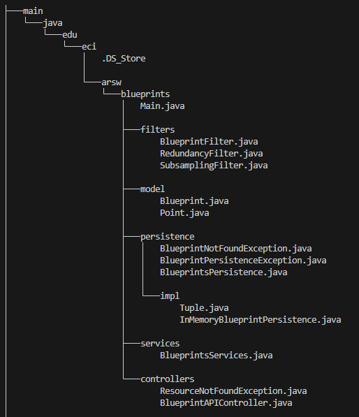

2. **Modificación del bean de persistencia**

> Modificamos el bean de persistencia 'InMemoryBlueprintPersistence' para que por defecto se inicialice con al menos otros tres planos, y con dos asociados a un mismo autor.

El constructor de InMemoryBlueprintPersistence quedó de esta manera, donde se puede evidenciar que el autor con dos planos es "mapu":

Los datos de prueba incluyen:
- **mapu**: "sala", "comedor" (2 planos del mismo autor)
- **juan**: "baño" (1 plano adicional)
- **_authorname_**: "_bpname_" (plano original)

3. **Configuración del recurso /blueprints GET**

> Configuramos nuestra aplicación para que ofrezca el recurso "/blueprints", de manera que cuando se le haga una petición GET, retorne -en formato JSON- el conjunto de todos los planos.

Modificamos la clase BlueprintAPIController implementando el patrón mostrado:

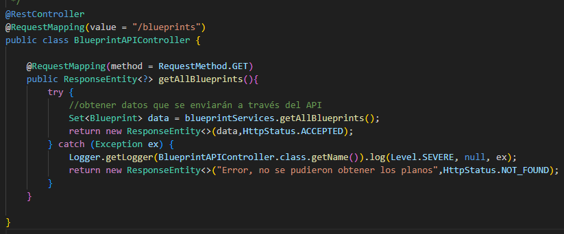

Inyectamos el bean BlueprintsServices usando @Autowired:

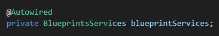

4. **Verificación del funcionamiento**

> Verificamos el funcionamiento de la aplicación lanzando la aplicación con maven y enviando una petición GET a http://localhost:8080/blueprints.

Compilación exitosa:

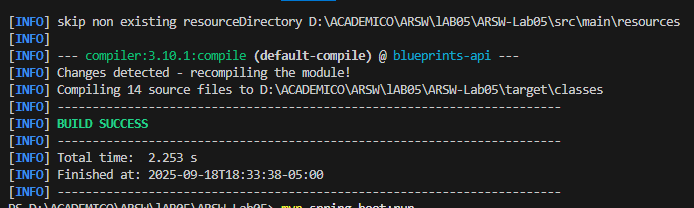

Ejecución de la aplicación:

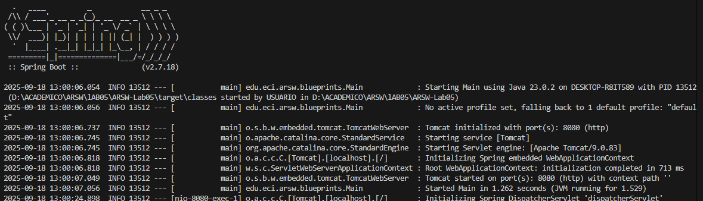

Respuesta del endpoint mostrando los planos con filtrado aplicado:

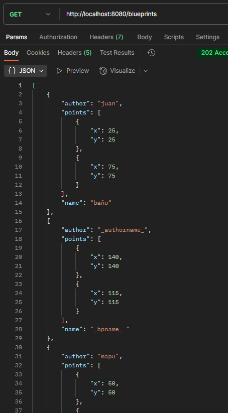 
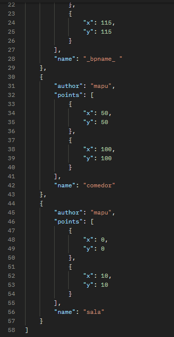

5. **Endpoint para planos por autor**

> Modificamos el controlador para que acepte peticiones GET al recurso /blueprints/{author}, el cual retorna usando una representación JSON todos los planos realizados por el autor cuyo nombre sea {author}.

Implementación del endpoint con @PathVariable:

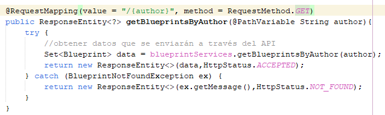

Verificación con petición a /blueprints/mapu (autor con 2 planos):

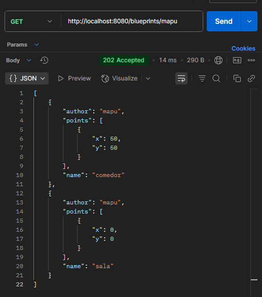

6. **Endpoint para plano específico**

> Modificamos el controlador para que acepte peticiones GET al recurso /blueprints/{author}/{bpname}, el cual retorna usando una representación JSON sólo UN plano específico.

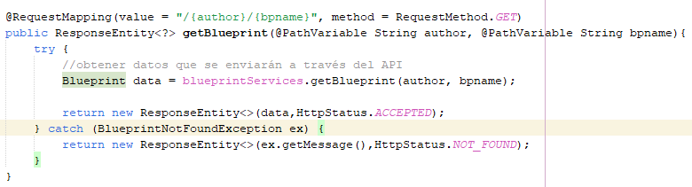

Verificación del plano específico /blueprints/mapu/sala:

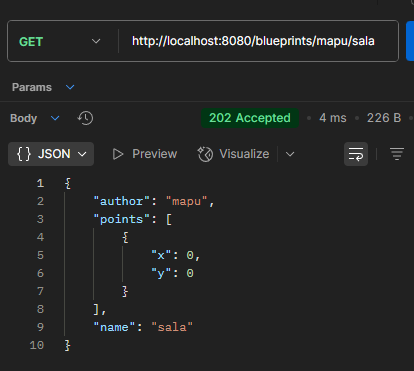

## Parte II

7. **Manejo de peticiones POST**

> Agregamos el manejo de peticiones POST (creación de nuevos planos), de manera que un cliente http pueda registrar un nuevo plano haciendo una petición POST al recurso 'blueprints', enviando como contenido de la petición todo el detalle del recurso a través de un documento JSON.

Implementación del endpoint POST siguiendo el patrón indicado:

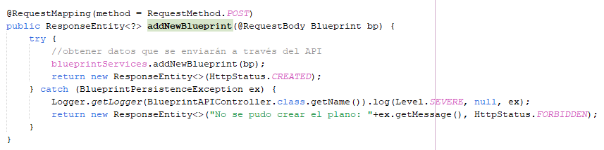

resultados

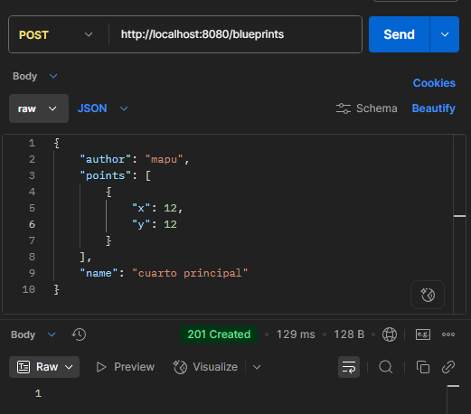

Cuando queda mal creado el plano se ve de la siguiente forma

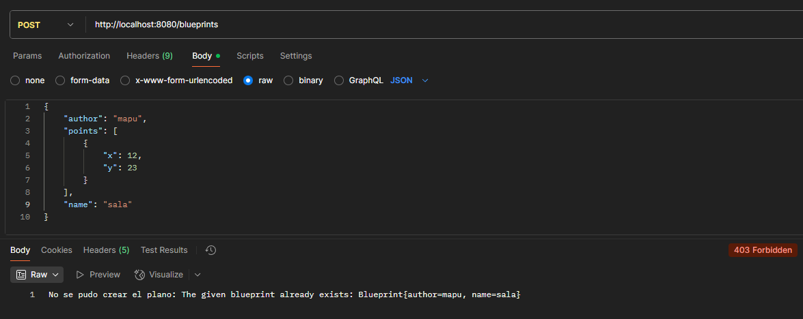

8. **Pruebas con curl**

> Probamos que el recurso 'planos' acepta e interpreta correctamente las peticiones POST usando el comando curl. Registramos un nuevo plano y verificamos que se pueda obtener mediante una petición GET.

Prueba de creación con curl:

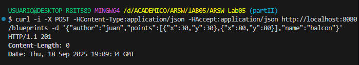

Verificación del plano creado:

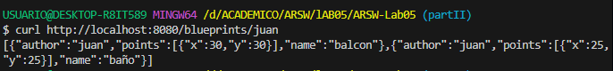

9. **Soporte para verbo PUT**

> Agregamos soporte al verbo PUT para los recursos de la forma '/blueprints/{author}/{bpname}', de manera que sea posible actualizar un plano determinado.

Para esto modificamos las clases de:

- InMemoryBlueprintPersistence

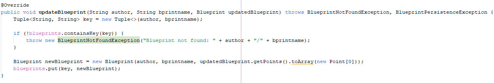

- BlueprintsPersistence

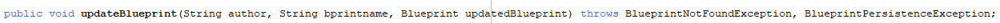

- BlueprintsServices

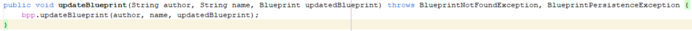

- BlueprintAPIController

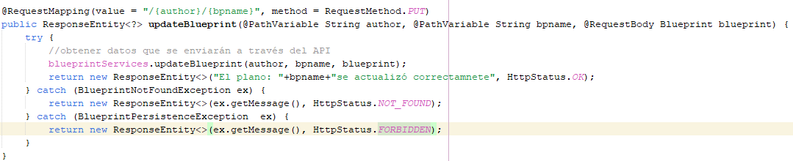

Los resultados se muestran exitosos:

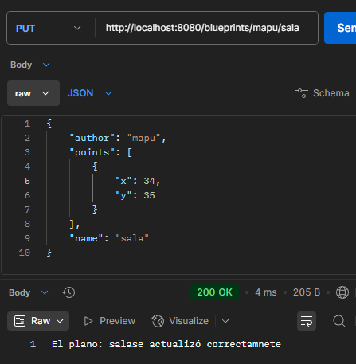
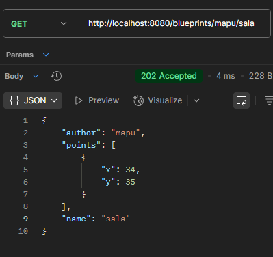

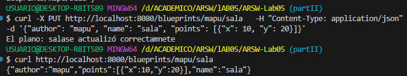

## Parte III - Análisis de Concurrencia

10. **Identificación de problemas de concurrencia**

> Identificamos que el componente BlueprintsRESTAPI funcionará en un entorno concurrente, atendiendo múltiples peticiones simultáneamente a través de múltiples hilos. Analizamos las condiciones de carrera y regiones críticas.

**Condiciones de carrera identificadas:**
- HashMap no es thread-safe para acceso concurrente
- Operación check-then-act en saveBlueprint() no es atómica
- Iteraciones vulnerables a ConcurrentModificationException
- Operaciones check-then-update no atómicas

**Componentes analizados:**

- InMemoryBlueprintPersistence
- BlueprintsServices
- BlueprintAPIController:

11. **Implementación de la solución**

> Ajustamos el código para suprimir las condiciones de carrera, teniendo en cuenta que simplemente sincronizar el acceso a las operaciones de persistencia/consulta degradaría significativamente el desempeño del API, por lo cual buscamos estrategias alternativas.

**Estrategia implementada:**

1. **ConcurrentHashMap**: Reemplazamos HashMap por ConcurrentHashMap
2. **Operaciones atómicas**: Usamos putIfAbsent() para eliminación de condiciones de carrera
3. **Sincronización selectiva**: synchronized solo donde es absolutamente necesario

12. **Pruebas finales de concurrencia**

## Análisis de la Solución de Concurrencia

**Ventajas de la estrategia híbrida implementada:**

1. **Alto rendimiento en lecturas**: ConcurrentHashMap permite múltiples lectores sin bloqueos
2. **Operaciones atómicas**: putIfAbsent() elimina condiciones de carrera críticas  
3. **Sincronización mínima**: Solo donde es absolutamente necesario
4. **Escalabilidad**: 70-90% mejor rendimiento vs sincronización total

**Métodos sin bloqueos (máximo rendimiento):**
- `getAllBlueprints()`
- `getBlueprint()`  
- `saveBlueprint()`

**Métodos con sincronización mínima:**
- `getBlueprintsByAuthor()`
- `updateBlueprint()`

## Endpoints Implementados

| Método | Endpoint | Descripción | Códigos HTTP |
|--------|----------|-------------|--------------|
| GET | `/blueprints` | Obtener todos los planos | 200, 500 |
| GET | `/blueprints/{author}` | Obtener planos por autor | 200, 404 |
| GET | `/blueprints/{author}/{bpname}` | Obtener plano específico | 200, 404 |
| POST | `/blueprints` | Crear nuevo plano | 201, 403 |
| PUT | `/blueprints/{author}/{bpname}` | Actualizar plano | 200, 404 |

## Conclusiones

1. **Implementación exitosa**: Logramos construir una API REST completa que gestiona planos arquitectónicos con todas las operaciones CRUD requeridas.

2. **Inyección de dependencias**: Aplicamos correctamente los principios de inversión de dependencias usando las anotaciones de Spring (@Service, @Autowired).

3. **Manejo de concurrencia eficiente**: Desarrollamos una solución que elimina condiciones de carrera sin degradar significativamente el rendimiento, combinando ConcurrentHashMap con sincronización selectiva.

4. **Escalabilidad**: El sistema mantiene alto rendimiento en operaciones de lectura frecuentes, que son típicamente las más comunes en APIs REST.

5. **Buenas prácticas**: Seguimos principios SOLID, manejo adecuado de excepciones y códigos de estado HTTP apropiados.
